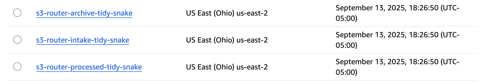
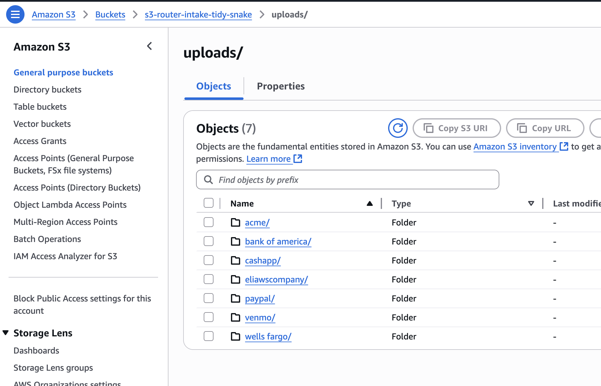
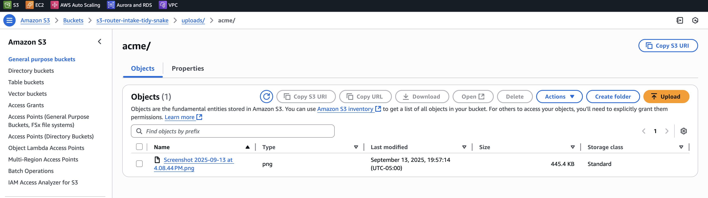
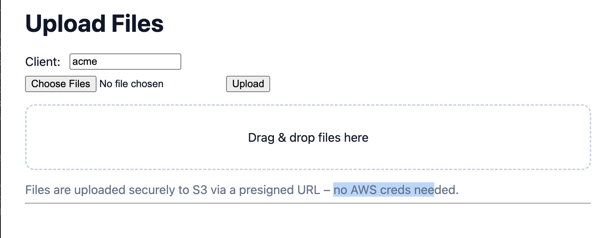
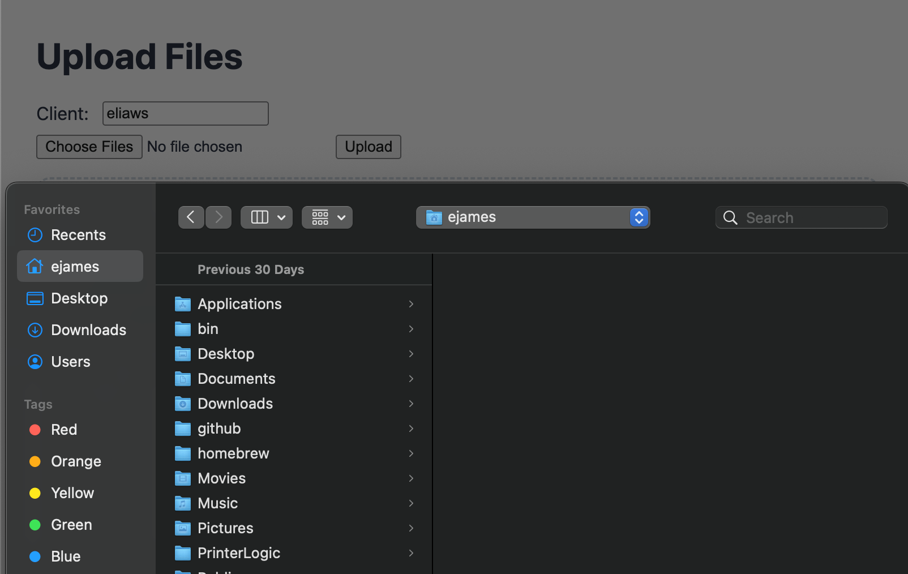
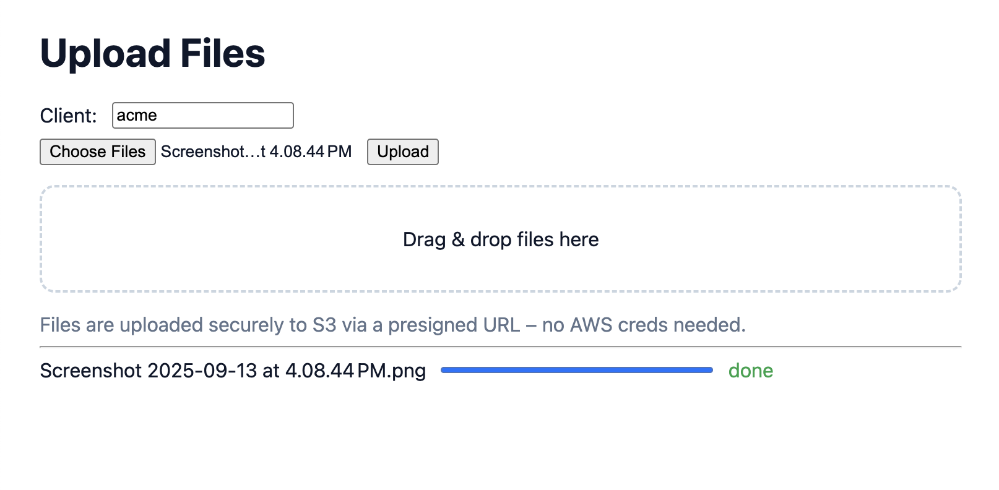
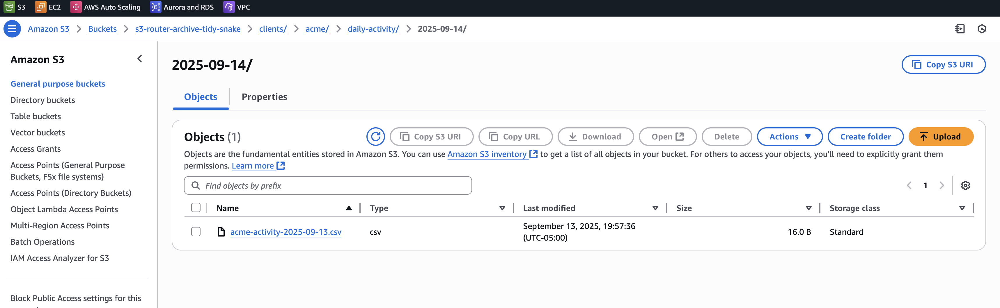
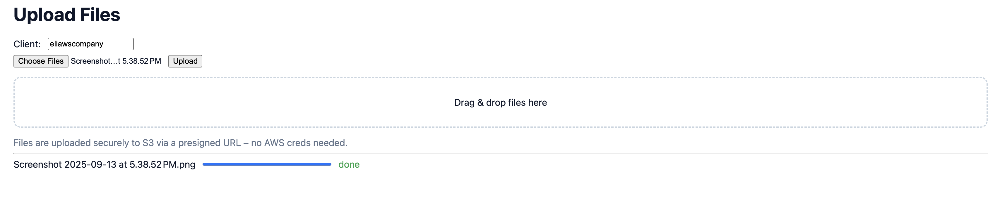
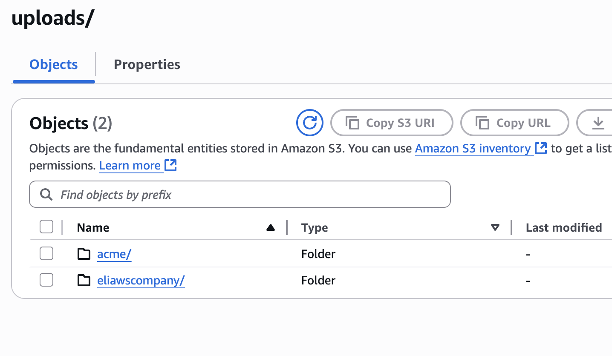
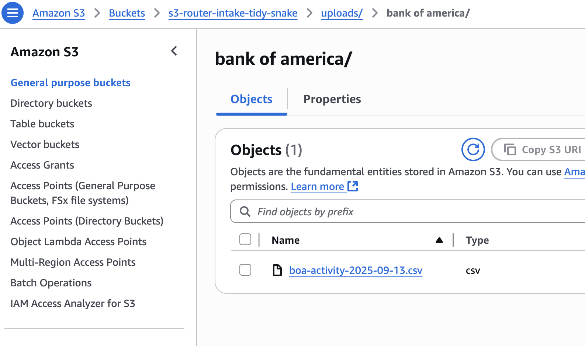

# Serverless S3 Router

This project implements a serverless pipeline for securely ingesting client files, processing them into a structured S3 layout, archiving prior versions, and exposing them through a CloudFront distribution. It uses Terraform for infrastructure as code, AWS Lambda for file routing, and API Gateway for presigned URL generation

## Architecture

**Key AWS Components:**
- **S3 Buckets**
  - **Intake bucket**: client uploads land here via presigned URLs
  - **Processed bucket**: organized into `clients/<client>/<doctype>/current/`
  - **Archive bucket**: old versions moved into `clients/<client>/<doctype>/<date>/`
- **SQS Queue**: buffers S3 events before they reach Lambda
- **Lambda (Router)**: classifies files, moves them into the correct structure, and archives prior versions
- **DynamoDB**: tracks file metadata and processing status
- **API Gateway**: exposes an endpoint to generate presigned upload URLs
- **CloudFront**: serves processed files securely to clients

## Workflow

1. **Upload**
   - Clients request a presigned URL from the `/upload-url` API endpoint
   - API Gateway requires an `x-api-key` for authentication
   - Clients upload directly to the intake S3 bucket using the URL

2. **Processing**
   - Intake bucket triggers an S3 event → SQS → Lambda
   - Lambda determines the client and document type (`daily-activity` or `daily-balance`)
   - New file is moved to the processed bucket under `current/`
   - If a prior file exists, it is copied into the archive bucket with a date-based folder

3. **Access**
   - Clients access the latest processed files via CloudFront
   - Archived history remains available in the archive bucket

## Features

- **Scalability**: Built on S3 and Lambda, automatically scales with traffic
- **Security**: 
  - IAM policies enforce least privilege
  - API Gateway with API key to restrict presign access
  - CloudFront Origin Access Control to prevent direct S3 access
- **Reliability**:
  - SQS ensures retries if Lambda fails
  - DynamoDB keeps a log of file activity
- **Cost-efficiency**:
  - Serverless architecture with pay-per-use pricing
  - S3 lifecycle policies for expiring old raw uploads

## Screenshots
## Disclaimer: All companies in the screenshots are fake(demo names) and do not actually represent real organizations

### Buckets and Uploads

